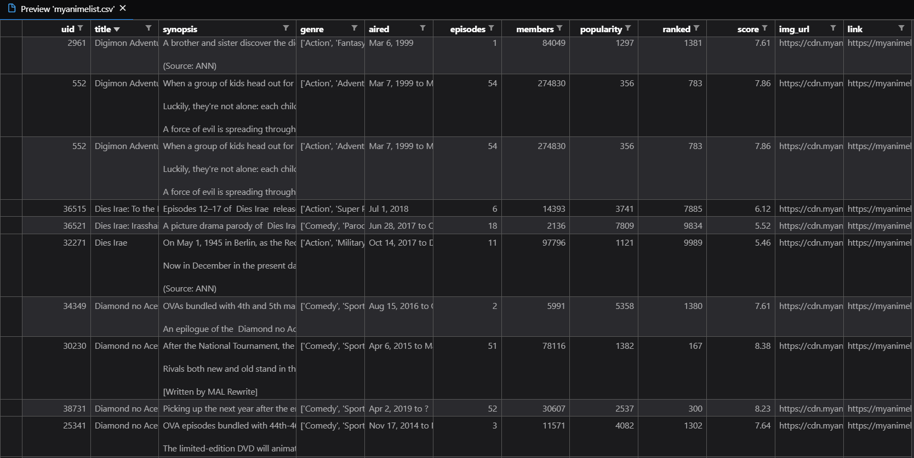
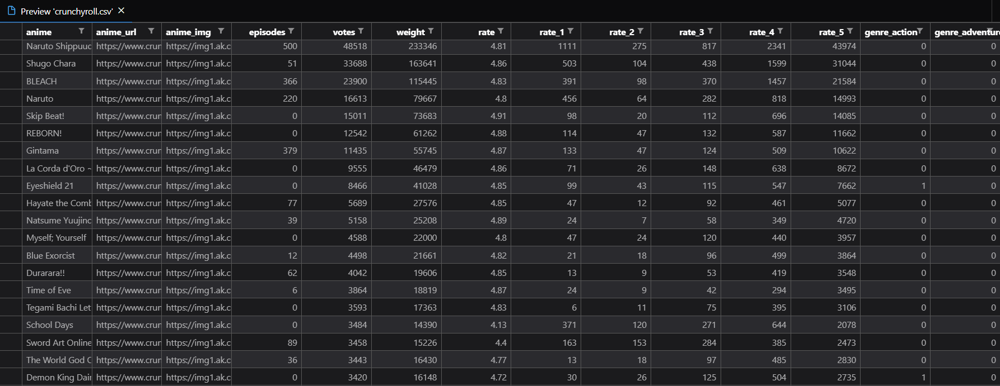
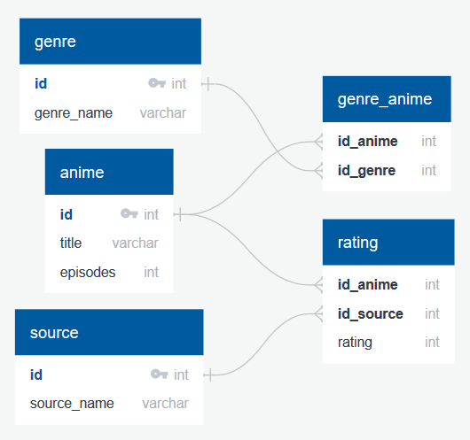
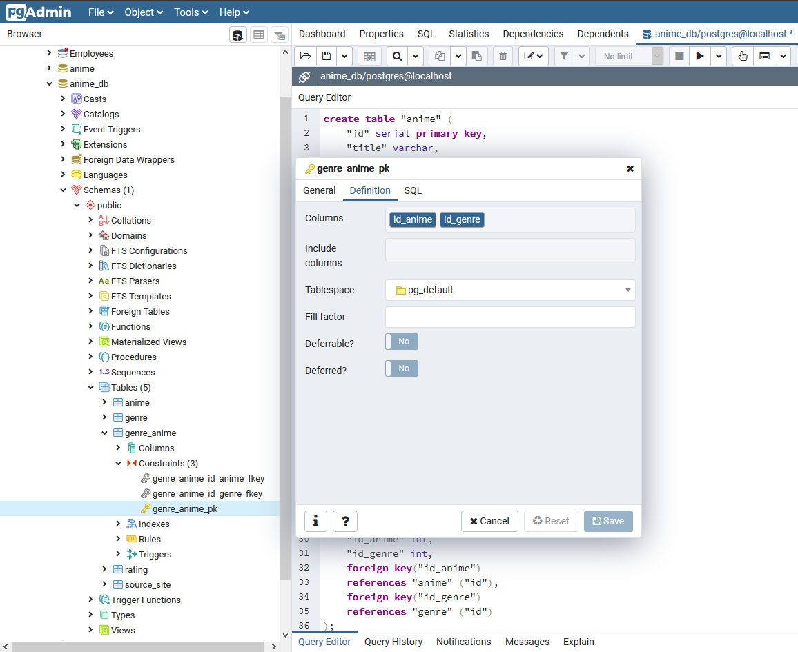
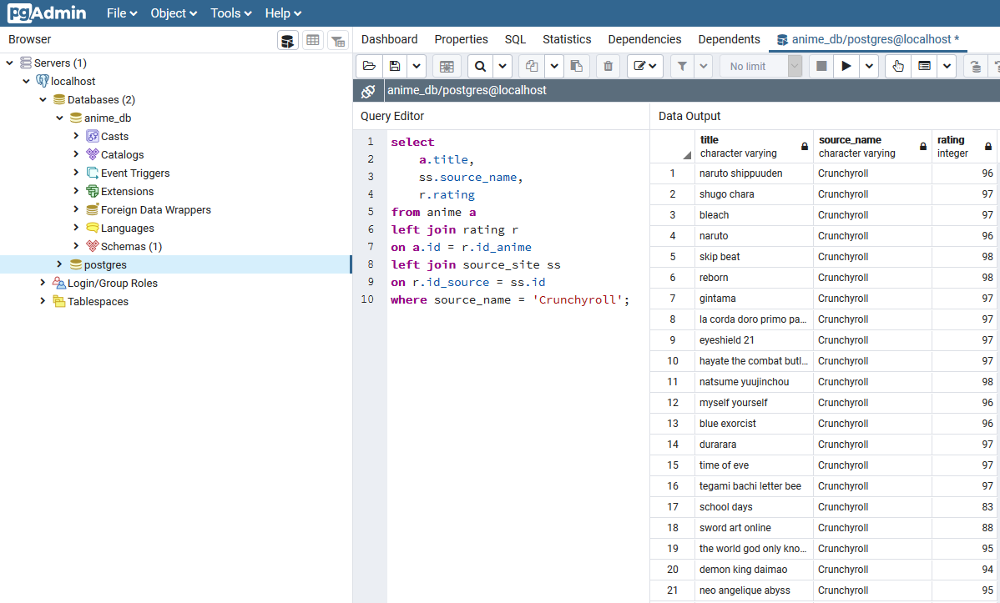

# Anime Database - Combining Crunchyroll and MyAnimeList


## Data

MyAnimeList is an anime and manga social networking and social cataloging application website that provides a list-like system to organize and score anime and manga. On the other hand, Crunchyroll is an American distributor, publisher, and licensing company focused on streaming anime, manga, and dorama to registered users and paid subscribers. Since both of these sites deal with anime data but for different propurses, we were interested in seeing how the largest anime and manga database information differed from one of the streaming services of the largest collection of licensed anime.

For that we retrieve two datasets from Kaggle: [Anime Dataset with Reviews - MyAnimeList](https://www.kaggle.com/marlesson/myanimelist-dataset-animes-profiles-reviews), created by Marlesson, and [Crunchyroll animes database](https://www.kaggle.com/filipefilardi/crunchyroll-anime-ratings), created by filipefilardi.

### Objective

The objetive with this project, was to:

* Extract,
* Transform,
* and Load anime data

## Results

### Extract

For the MyAnimeList we only used the [anime.csv](datasets/myanimelist.csv) with:

* ID - internal id of anime
* title - japanese name in romaji
* synopsis - brief summary of the anime 
* genre - list of genres
* aired - aired dates, initial to final if they have more than 1 episode
* episodes - number of episodes
* members - members that have added this anime into their lists
* popularity - ranking regarding number of members that have added this anime into their lists
* ranked - anime's rank regarding the aggregate rating
* image url - image url from MyAnimeList
* link - url from MyAnimeList



The crunchyroll database only contained one [csv file](datasets/crunchyroll.csv) with:

* anime - English name of the anime
* anime_url - anime URL on Crunchyroll
* anime_img - anime image URL hosted by Crunchyroll
* episodes - number of episodes hosted by Crunchyroll of the anime
* votes - number of votes of the anime
* votes_weight - the sum of rated stars received of the anime
* rate_1_stars - the quantity of 1 stars votes of the anime
* rate_2_stars - the quantity of 2 stars votes of the anime
* rate_3_stars - the quantity of 3 stars votes of the anime
* rate_4_stars - the quantity of 4 stars votes of the anime
* rate_5_stars - the quantity of 5 stars votes of the anime
* rate - an average rating out of 5 stars of the anime
* genres - 29 different genres of the anime, one column for each genre with 1 and 0



### Transform

#### Clean data

##### General

* Drop duplicates in column title.
* Set all titles in lower de case to standarize titles.
* Remove non alphabeticals characters inside titles.
* Normalize rate, and score information respectibly to have the same measurement.

##### Crunchyroll data

* Inspect columns of the data to transpose genre columns to rows using melt function.
* Delete value column and rename values inside the genre column without the 'genre_'.
* Rename columns to title, url, score, and genre.

##### MyAnimeList data

* Inspect columns of the data.
* Create list to contain the information per anime per genre listed to start the normalization of genre.
* Iterate each row to delet symbols inside genre values and divide their values.
* Iterate each of the previous values to add independent title, episodes, scores, and link.
* Define dictionary to contain the previous lists to create a new dataframe.
* Exploration of the new MyAnimeList's dataframe.
* Delete symbols inside values in genre column and make them lower case.

#### Transform data

* Add id-source to each dataframe.
* Re-inspect dataframes to review the information stored.
* Rename link to url to have the same names for both tables.
* Match type of data by changing type of episodes in MyAL.
* Append both dataframes and reset index (`merged dataframe`).

#### Generate data model



* Create independent tables of the model

### Load

> Created database as `anime_db` and created tables as decribed [here](datamodel/schema.sql) inside postgreSQL. Manually created primary key for genre_anime with the combination of both id's (id_anime & id_genre)



* Generate connection with postgreSQL
* Confirm tables created
* Load `anime` and `genre` tables
* Manually added information to `source_site` table

    ```SQL
    insert into source_site (source_name)
    values ('Crunchyroll'),
        ('MyAnimeList');
    ```

* Create a table selecting only title and genre from the `merged dataframe` and drop duplicates.
* Obtain values from the `anime` & `genre` table inside the anime database by reading the SQL table.
* Merge the `anime` & `genre` tables just obtained with the table created before with just the title and genre to cross `id_anime` and `id_genre`
* Load this new table with id's to `genre_anime`
* Merge the `merged dataframe` with `anime` table to obtain `id_anime`.
* Rename columns to match names inside `rating` table.
* Load new `rating` table.

## Test 



### Copyright

First image not owned, retrived from La Taberna del BI on 14/07/2020.
